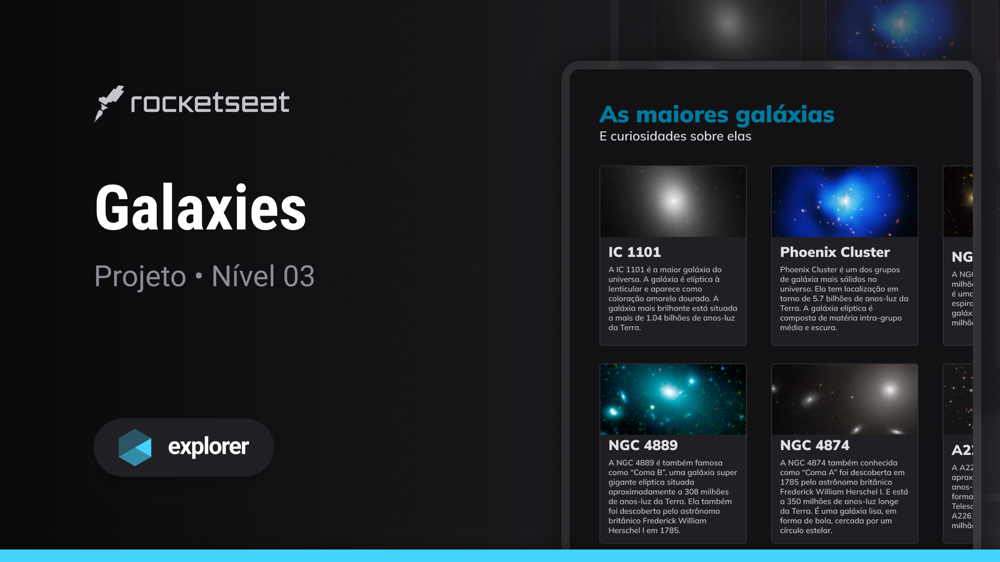

<h1 align="center"> Galaxies </h1>

Projecto exclusivo, para o aprendizado de algumas tecnologias WEB.  

  <a href="#-tecnologias">Tecnologias</a>&nbsp;&nbsp;&nbsp;|&nbsp;&nbsp;&nbsp;
  <a href="#-projeto">Projeto</a>&nbsp;&nbsp;&nbsp;|&nbsp;&nbsp;&nbsp;
  <a href="#-layout">Layout</a>&nbsp;&nbsp;&nbsp;|&nbsp;&nbsp;&nbsp;
  <a href="#memo-licença">Licença</a>

  

 

  

## 🚀 Tecnologias

Esse projeto foi desenvolvido com as seguintes tecnologias:

- HTML e CSS
- Git e Github
- Figma

## 💻 Projeto

O Galaxies é uma página para a descrição de algumas galaxias existentes cientificamente .

## 🔖 Layout

Você pode visualizar o layout do projeto através [DESSE LINK](<[https://www.figma.com/file/Byw4X5etg8VCmezueyhzkC/Ecoleta-(Starter)?type=design&node-id=136%3A546&mode=design&t=MazLfcFvTQET231X-1](https://www.figma.com/file/lYsJUCgK5aLVMLaBOIrVLI/Galaxies-%E2%80%A2-Projeto-Explorer-(Community)?type=design&node-id=115%3A3&mode=design&t=2gyUhU6tcZxIlPW6-1)>). É necessário ter conta no [Figma](https://figma.com) para acessá-lo.

## :memo: Licença

Esse projeto está sob a licença MIT.

---

Feito por Clemilson Azevedo aluno da [Rockeatseat](https://www.rocketseat.com.br/).
